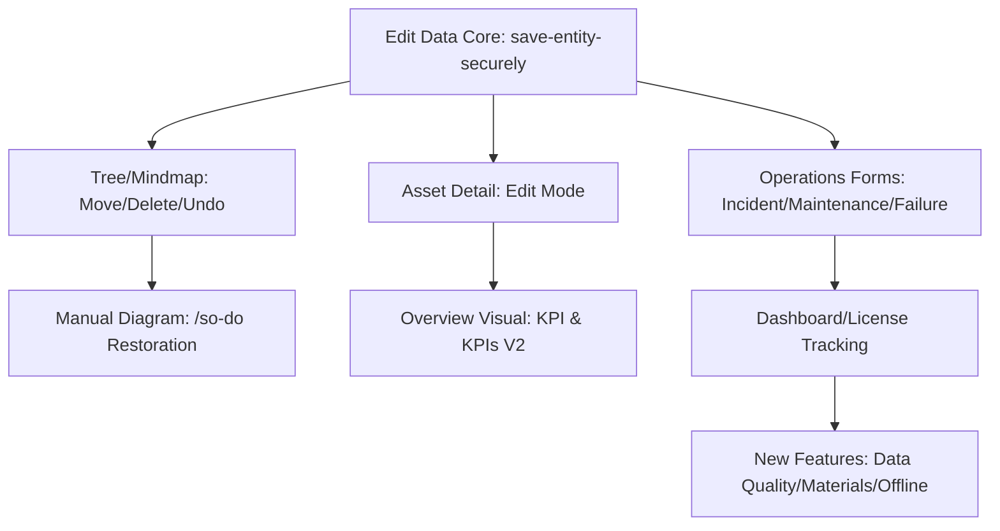

# Kế hoạch Phát hành (Release Plan) MIRATS 2.0

## A. Dependency Graph (Biểu đồ Phụ thuộc)

## B. Branch & Commit Strategy
- **Chiến lược:** Mỗi nhóm hành vi (behavior group) tương ứng một commit nguyên tử.
- **Quy tắc:** Không squash commit trước khi nghiệm thu (UAT) để dễ dàng rollback từng phần nếu phát hiện lỗi logic.
- **Commit Naming:** `feat(parity): restore [module_name] behavior`, `fix(core): secure write pipeline mapping`.

## C. Feature Flags & Rollback Strategy
Sử dụng `src/lib/mirats/feature-flags.ts` để kiểm soát các module nhạy cảm:
- `importEngineUnified`: Bật khi Import Studio đạt parity 100%.
- `reliabilityKpiV2`: Bật để chuyển đổi công thức MTTR/MTBF sang engine mới.
- `baoTriKpiV2`: Bật cho báo cáo PM (Preventive Maintenance).
- **Rollback:** Tắt flag trong localStorage hoặc hoàn tác commit behavior group tương ứng.

## D. Migration Staging Plan
- **Staging:** Áp dụng 23 migration mới lên môi trường Staging (preview URL) trước.
- **Production:** Tuyệt đối không chạy migration thủ công trên DB Production. Sử dụng CI/CD pipeline tự động.
- **Data Integrity:** Kiểm tra RLS và GRANT cho các bảng danh mục mới (`dm_phan_loai`, `dm_nhom_he_thong`, `dm_he_thong`).

## E. Regression Suite (Danh mục Kiểm thử)
1. **Tree/Mindmap:** Tìm kiếm -> Tự động mở rộng -> Sửa tên -> Di chuyển -> Xóa -> Hoàn tác -> Tải lại trang giữ trạng thái.
2. **Manual Diagram (/so-do):** Tạo mới -> Vẽ -> Kết nối node -> Lưu -> Tải lại.
3. **Unified Write:** Sửa PL/NH/HT/TB, kiểm tra dữ liệu đi đúng bảng DB (`thiet_bi` vs `dm_*`).
4. **Asset Detail:** Kiểm tra phân quyền (Admin được sửa, KTV chỉ được đọc/gửi Change Request).
5. **Operations Forms:** So khớp payload JSONB gửi lên RPC `ghi_*_full` so với bản "chaytot".
6. **Overview:** So sánh pixel-perfect với ảnh chụp màn hình Golden Screenshot.
7. **Offline:** Ngắt mạng -> Thêm sự cố -> Kết nối lại -> Kiểm tra Outbox đồng bộ.
8. **Scope/RLS:** Đăng nhập tài khoản đơn vị A, không thấy tài sản đơn vị B.

## F. Go/No-Go Checklist
- [ ] `npx tsc --noEmit` vượt qua không lỗi.
- [ ] `npm run build` thành công trên môi trường Edge.
- [ ] 100% Unit/Integration tests xanh (đặc biệt các file trong `src/lib/mirats/__tests__`).
- [ ] Không còn `console.log` debug, TODO, hoặc toast thông báo giả trong mã nguồn production.
- [ ] Không sử dụng `service_role` cho các thao tác từ phía người dùng (tuân thủ RLS).
- [ ] Biên bản Parity được Chủ dự án ký duyệt dựa trên ảnh chụp đối chiếu.

## G. Quan sát Sau Phát hành (Post-Release Monitoring)
- **Error Tracking:** Theo dõi log Sentry/Cloudwatch cho các lỗi `403 Forbidden` (RLS) hoặc `500` (RPC).
- **Audit Logs:** Kiểm tra bảng `audit_log` cho các thao tác nhạy cảm.
- **Outbox Sync:** Theo dõi số lượng yêu cầu treo trong `offline_queue`.
- **Change Requests:** Giám sát các yêu cầu thay đổi từ User/KTV để đảm bảo luồng phê duyệt hoạt động.
